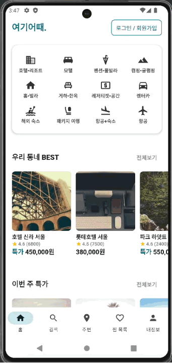
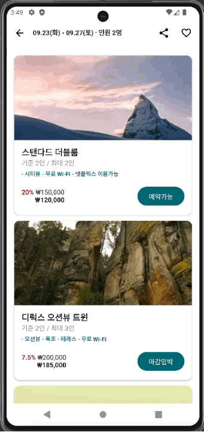
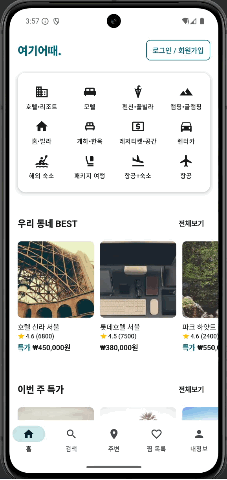
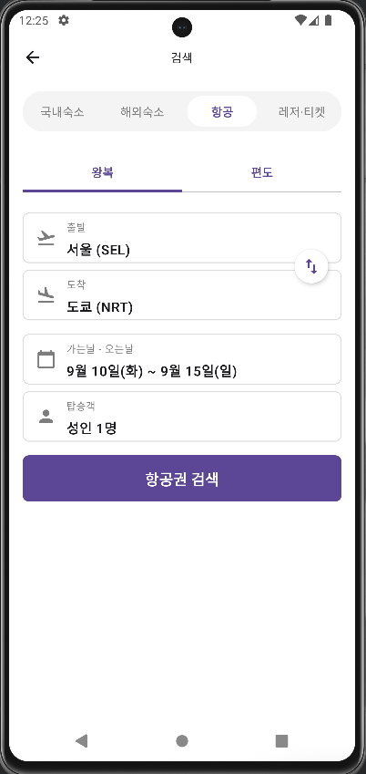
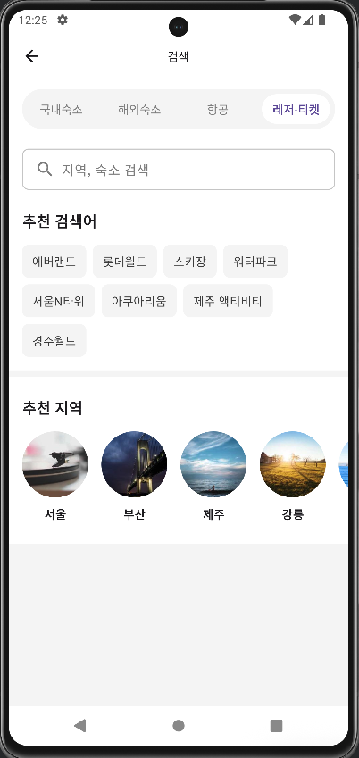
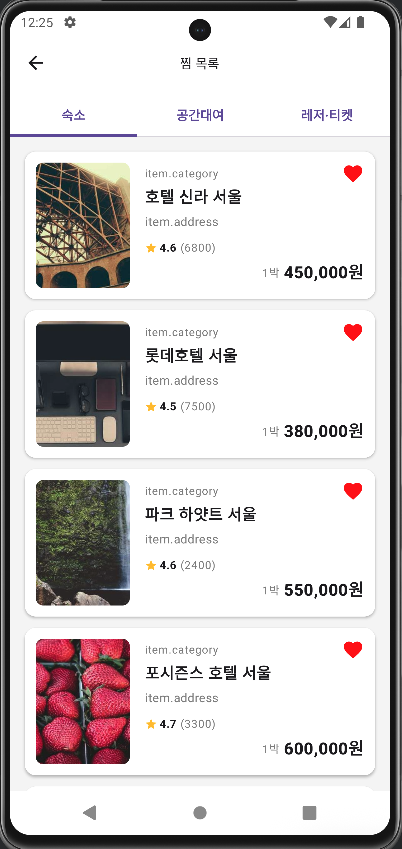

# 여기어때 클론 프로젝트

## 📖 프로젝트 소개
실제로 자주 사용하는 여행 서비스 ‘여기어때’를 클론 코딩한 프로젝트입니다.
단순히 UI만 구현한 것이 아니라, Dummy 데이터를 실제 서비스 구조에 맞게 설계하여 실제 서비스와 유사한 데이터 흐름을 구현했습니다. 
이를 통해 단순한 화면 구현을 넘어, 서비스 전반의 작동 방식을 이해하고 개발자로서의 역량을 확장하는 데에 목적을 두었습니다.

또한, 규모가 크고 다양한 기능을 가진 서비스인 만큼, 복잡한 데이터 구조와 화면 흐름을 학습하기에 적합하다고 판단하여 ‘여기어때’를 클론 프로젝트 대상으로 선택했습니다. 


현재는 로컬 데이터를 기반으로 작동하지만, 향후 Firebase를 연동하여 서버 통신 환경까지 확장할 계획입니다.

## 🛠 기술 스택
|Category|Technology|
|-------|-----------|
|Language|Kotlin|
|UI Framework|Jetpack Compose (Material3)|
|Architecture|MVI, Feature-based Modularization|
|DI|Hilt|
|Async|Coroutines, Flow|
|Navigation|Compose Navigation|
|Network/Server|Firebase (예정), Gson (Dummy Data Parsing)|
|Image Loading|Coil|

## ✨ 주요 기능

## 🏞️ 화면
<p>
  
  
  
  
</p>
<p>
  
  
  
</p>

## ✨ 주요 기능 (Key Features)
### 1. 홈 화면 (Home)
- 복합 레이아웃 구현: 상단 배너, 아이콘 그리드, 추천 리스트 등 다양한 뷰 타입을 LazyColumn 내에 조합하여 구현했습니다.
- Sticky Header: 스크롤 시 카테고리 탭이 상단에 고정되는 인터랙션을 구현했습니다.

### 2. 숙소 리스트 및 상세 (Hotel & Accommodation)
- 카테고리별 필터링: 호텔, 펜션, 모텔 등 숙소 유형에 따른 리스트 필터링 기능을 제공합니다.
- 상세 정보 뷰: 이미지 슬라이더(Pager), 객실 정보, 편의시설 안내 등 복잡한 상세 화면 UI를 구성했습니다.

### 3. 예약 및 결제 (Payment)
- 데이터 전달: 선택한 객실 정보와 날짜 데이터를 결제 화면으로 전달하는 흐름을 구현했습니다.
- 사용자 입력 처리: 예약자 정보 입력 및 결제 수단 선택 UI를 구현했습니다.

### 4. 검색 및 최근 본 상품 (Search & History)
- Room/DataStore 활용: 사용자가 조회한 숙소를 로컬에 저장하여 '최근 본 상품' 기능을 구현했습니다.

## 📂 프로젝트 구조
```markdown
yeogi-clone/
    ├── core/                   # 공통으로 사용되는 모듈
    │   ├── data/               # 공통 데이터 모델 및 더미 데이터 소스
    │   ├── model/
    │   ├── util/               # 확장 함수 및 유틸리티
    │   └── presentation/       # 공통 UI 컴포넌트 (버튼, 탑바 등)
    ├── feature/                # 기능별 패키지 (화면 단위)
    │   ├── home/               # 홈 화면 관련 (UI, ViewModel, Repo)
    │   ├── hotel/              # 숙소 리스트 관련
    │   ├── accommodation/      # 숙소 상세 정보 관련
    │   ├── payment/            # 결제 관련
    │   └── ...
    ├── navigation/             # 네비게이션 그래프 및 라우트 정의
    ├── main/                   # 앱 진입점 및 BottomNavigation
    └── MainActivity.kt
```

## 👀 개발 과정에서 발생한 이슈 (Troubleshooting)
### 1. 복잡한 UI 상태 관리와 리컴포지션 최적화
- 문제: 홈 화면에 많은 이미지와 컴포넌트가 배치되면서 스크롤 시 버벅임이 발생했습니다.
- 해결: LazyColumn의 key를 명시적으로 지정하여 불필요한 리컴포지션을 방지하고, Coil 이미지 로더의 캐싱 전략을 적용하여 스크롤 성능을 개선했습니다.

### 2. 실제 서비스와 유사한 더미 데이터 설계
- 고민: 단순히 하드코딩된 UI가 아니라, 실제 서버에서 받아온 것처럼 유기적으로 연결된 데이터가 필요했습니다.
- 해결: JSON 파일로 숙소-객실-리뷰 관계를 1:N 구조로 설계하고, Repository 레이어에서 이를 파싱하여 제공함으로써 실제 API 통신과 유사한 환경을 구축했습니다.

## 🎯 개발 계획
- Firebase 연동: 현재 로컬 더미 데이터로 작동하는 부분을 Firebase Firestore로 마이그레이션하여 실시간 데이터 반영.
- 로그인/회원가입: Firebase Authentication을 이용한 사용자 인증 구현.
- 지도 기능: Naver Map API를 활용하여 숙소 위치 표시 기능 추가.
- 유닛 테스트: 핵심 비즈니스 로직(ViewModel)에 대한 JUnit 테스트 코드 작성.
